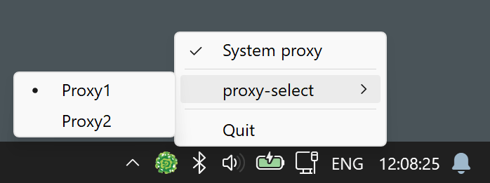

# sing-box-drover (Tray controller for sing-box on Windows)

sing-box-drover is a small helper program for Windows that runs the original `sing-box` in the background and provides
minimal, convenient control from the system tray:

- background start of `sing-box` with your config
- tray icon with current Windows system proxy status
- one-click enable/disable of the system proxy
- switching `selector` outbounds via the tray context menu

The goal is to keep the full power of a native `sing-box` config while adding just enough integration with Windows,
without turning into another heavy all-in-one client.

## Screenshot



## About sing-box and why this tool exists

sing-box is one of the main proxy/VPN engines used inside many modern clients. It is powerful and flexible but is
designed as a console application with JSON configuration files and no GUI. For non-technical users this is usually
inconvenient.

There are many GUI clients built on top of sing-box, but they usually:

- do not expose all features of the original config format
- are large and overcomplicated for simple use cases
- ship their own embedded, sometimes outdated, sing-box binaries

sing-box-drover takes a different approach:

- you download and use the official `sing-box.exe` yourself
- you keep your normal sing-box JSON config as-is
- the program only adds a small tray UI for system proxy control and outbound switching

This is close to how the official client works: full control stays in the config, and the UI is only a thin layer on
top.

## Features

### Implemented

- Runs the original sing-box in the background using a specified config file.
- Shows a tray icon that reflects whether the Windows system proxy is currently enabled.
- Enables or disables the system proxy with a single click on the tray icon.
- Reads `selector` outbounds from the sing-box config and shows them in the tray context menu.
- Switches outbounds via the `experimental.clash_api` interface (outbound change + connection reset).
- Optional automatic system proxy management on program start/exit.

### Not implemented

- No profile/config switching inside the program: only one sing-box config file is used (path is set in the program
  config).
- No TUN or full VPN mode: the program only manages the Windows system proxy settings.
- No built-in autostart manager (see the Autostart section below).

## Installation

1. Download sing-box-drover. Get the latest version of the program from
   the [latest release page](https://github.com/hdrover/sing-box-drover/releases/latest).

2. Download the official sing-box for Windows from the upstream project:  
   <https://github.com/SagerNet/sing-box/releases>  
   Choose an archive whose file name contains `windows-amd64`.

3. Place files
    - Put `sing-box-drover.exe` (and its config file from the archive) into any folder.
    - Put `sing-box.exe` into the same folder, or specify another folder via `sb-dir` (see below).
    - Prepare your sing-box JSON config file and point the program to it.

After that, run `sing-box-drover.exe`. A tray icon should appear; from there you can toggle the system proxy and switch
outbounds.

## Autostart

sing-box-drover does not have built-in autostart management.

If you want the program to start automatically with Windows:

1. Press **Win + R**.
2. Enter `shell:startup` and press **Enter**.
3. In the opened folder, create a shortcut to `sing-box-drover.exe`.

Windows will then launch sing-box-drover automatically for the current user at logon.

## sing-box configuration requirements

sing-box-drover expects some specific fields in the sing-box config.

### Required inbound

There must be an inbound of type `mixed`. The program reads its `listen` and `listen_port` and uses them to configure
the Windows system proxy:

```jsonc
{
  // ...
  "inbounds": [
    {
      "type": "mixed",
      "tag": "mixed-in", // any tag, not used by the program
      "listen": "127.0.0.1",
      "listen_port": 1080 // can be changed
    }
  ],
  // ...
}
```

The tag value is ignored by the program; only the type and address/port are important.

### Required Clash API section

To allow outbound switching from the tray menu, `experimental.clash_api` must be enabled:

```jsonc
{
  // ...
  "experimental": {
    "clash_api": {
      "external_controller": "127.0.0.1:9090", // can be changed
      "secret": "change-me" // any non-empty string
    }
  },
  // ...
}
```

- `external_controller` is the address where sing-box exposes the Clash-compatible API. The program connects to this
  address to change selectors and reset connections.
- `secret` is the API token. Use any non-empty string.

Without this section, sing-box-drover can still start sing-box and toggle the system proxy, but outbound switching
will not work.

### Selectors for outbound switching

In your `outbounds` section, define one or more `selector` outbounds. They will appear in the tray menu:

```jsonc
{
  // ...
  "outbounds": [
    {
      "type": "selector",
      "tag": "proxy-select",
      "outbounds": [
        "Proxy1",
        "Proxy2"
      ],
      "default": "Proxy1",
      "interrupt_exist_connections": true
    },
    // plus your normal outbounds
  ],
  // ...
}
```

- The selector `tag` is used as the submenu title.
- Each value inside `outbounds` becomes an item in the submenu.
- The `default` value is checked when the program starts; the program also resets selectors to their default values once
  at startup.

## Program configuration

The program uses a simple INI-style config file that ships in the archive. The default content looks like this:

```ini
[sing-box-drover]
sb-dir =
sb-config-file = config.json
system-proxy-auto = 1
; Selector menu layout: "flat" or "nested"
selector-menu-layout = flat
```

Parameters:

- `sb-dir` – path to the folder with `sing-box.exe`.  
  If empty, the program searches for `sing-box.exe` in its own folder.

- `sb-config-file` – sing-box config file.  
  You can specify just a file name or an absolute path.

- `system-proxy-auto` – automatic management of the Windows system proxy:
    - `1` – enable the system proxy when the program starts and disable it when the program exits, while still allowing
      manual toggling.
    - `0` – do not change the system proxy automatically; only manual toggling via the tray icon.

- `selector-menu-layout` – layout of selectors in the tray menu:
    - `flat` (default) – each selector name is shown as a disabled header, with its options as radio items below, separated by a divider.
    - `nested` – each selector is shown as a submenu containing its options.

The rest of the behavior is fully controlled by your sing-box configuration.
